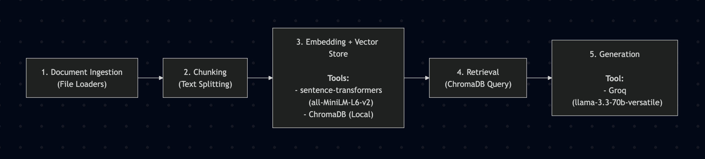

# Project 1 Planning: The Unofficial Guide

> Write this document before you write any pipeline code.
> Your spec and architecture diagram are what you'll use to direct AI tools (Claude, Copilot, etc.) to generate your implementation — the more specific they are, the more useful the generated code will be.
> Update the Retrieval Approach and Chunking Strategy sections if you change your approach during implementation.
> Update this file before starting any stretch features.

---

## Domain

<!-- What domain did you choose? Why is this knowledge valuable and hard to find through official channels? 

I chose an information compilation for UCLA neuroscience undergrads. This knowledge can typically be quite scattered, since the department is actually an interdepartmental group, and doesn't only cater to undergrads. As a result, it's you might find info on the official website, student run forums, or Reddit.

-->

---

## Documents

<!-- List your specific sources: URLs, subreddit names, forum threads, or file descriptions.
     Aim for at least 10 sources that together cover different subtopics or perspectives within your domain. -->

| # | Source | Type | URL or file path |
|---|--------|------|-----------------|
| 1 | reddit | forum post| https://www.reddit.com/r/ucla/comments/heshap/a_little_neuroscience_advice/|
| 2 | reddit | forum post | https://www.reddit.com/r/ucla/comments/1tx4w7h/recommended_first_quarter_freshman_classes_for/|
| 3 | reddit | forum post | https://www.reddit.com/r/ucla/comments/1siadcz/ucla_neuro_students_how_is_it/ |
| 4 | ucla neuro dep website | list of profs| https://www.neurosci.ucla.edu/faculty/|
| 5 | ucla neuro dep website | reqs page | https://www.neurosci.ucla.edu/program/major-requirements/|
| 6 | ucla neuro dep website | reqs page | https://www.neurosci.ucla.edu/program/minor-requirements/|
| 7 | ucla neuro dep website | reqs page | https://www.neurosci.ucla.edu/program/major-capstone/ |
| 8 | bruinwalk | prof review | https://www.bruinwalk.com/professors/natik-piri/all/ |
| 9 | bruinwalk | prof review | https://www.bruinwalk.com/professors/william-grisham/|
| 10 | bruinwalk | prof review | https://www.bruinwalk.com/professors/stephanie-a-white/ |

---

## Chunking Strategy

<!-- How will you split documents into chunks?
     State your chunk size (in tokens or characters), overlap size, and explain why those
     numbers fit the structure of your documents.
     A review-heavy corpus warrants different chunking than a long FAQ. -->

**Chunk size:**

I'm planning for a chunk size of 1,200 characters (approx. 300 tokens). I want to be able to capture an entire individual Bruinwalk review or a complete block of department requirements in a single chunk, but also ensure that the RAG assistant avoids merging unrelated Reddit discussions or different faculty descriptions into the same chunk.

**Overlap:**
After testing, 200 characters (about 50 tokens), or roughly 15-20% of the chunk size, seems to work best. This buffer ensures that important contextual data, such as course numbers or professor names, isn't cut in half if it falls on a chunk boundary. It maintains continuity across adjacent chunks without too much redundancy.

**Reasoning:**
After gathering the sources, I realized they're a wide mix of short, conversational forum posts and dense, structured academic requirements. Long-document chunking would blend distinct student opinions or separate major tracks together, and lead to noisy and inaccurate retrievals.

---

## Retrieval Approach

<!-- Which embedding model are you using (e.g., all-MiniLM-L6-v2 via sentence-transformers)?
     How many chunks will you retrieve per query (top-k)?
     If you were deploying this for real users and cost wasn't a constraint, what tradeoffs
     would you weigh in choosing a different embedding model — context length, multilingual
     support, accuracy on domain-specific text, latency? -->

**Embedding model:**
I'll be using sentence-transformers/all-MiniLM-L6-v2, since it's a small, lightweight model but is more than powerful enough for the relatively small chunks/data that we're working with.

**Top-k:**

Retrieving 3 chunks per query seems to be a good spot computationally and information-wise, considering the small amount of data (10 documents).

**Production tradeoff reflection:**
If budget was infinite, it'd be nice to use a larger model with more domain specificity (academic domain?), and with a much larger context window to process huge reddit megathreads, subreddits, etc.
---

## Evaluation Plan

<!-- List your 5 test questions with their expected correct answers.
     Questions should be specific enough that you can judge whether the system's response
     is right or wrong. "What are good dining halls?" is too vague.
     "What do students say about wait times at [dining hall name] during lunch?" is testable. -->

| # | Question | Expected answer |
|---|----------|-----------------|
| 1 | Who are the department chairs of the Undergraduate Neuroscience Interdepartmental Program?| Dr. Emily White is the chair, and Dr. Stephanie Leal is the Vice Chair.|
| 2 | What are the core upper division major requirements?| Neuro M101A/B/C, Neuro 102, Chem 153A |
| 3 | What rating does Professor White have for NEUROSC M101A?| 2.6|
| 4 | What is the minimum GPA for students to declare the Neuroscience minor?| 2.0 GPA overall, 2.5 in the prerequisite courses to M101A|
| 5 | Where is successful completion of the minor indicated?| On the transcript and the diploma.|

---

## Anticipated Challenges

<!-- What could go wrong? Name at least two specific risks with reasoning.
     Consider: noisy or inconsistent documents, missing source attribution, off-topic
     retrieval, chunks that split key information across boundaries. -->

1. Some of the reddit information is outdated, and might end up contradicting the up-to-date website or Bruinwalk information. This might lead to noisy/inconsistent results. 

2. Buinwalk reviews are slang-heavy. Will the model understand the semantic meaning of 'weeder class'? What about even 'prof'? This might lead to off-topic retrievals, and inconsistent results. 

---

## Architecture

<!-- Draw a diagram of your pipeline showing the five stages:
     Document Ingestion → Chunking → Embedding + Vector Store → Retrieval → Generation
     Label each stage with the tool or library you're using.
     You can use ASCII art, a Mermaid diagram, or embed a sketch as an image.
     You'll use this diagram as context when prompting AI tools to implement each stage. -->

---

## AI Tool Plan

<!-- For each part of the pipeline below, describe:
     - Which AI tool you plan to use (Claude, Copilot, ChatGPT, etc.)
     - What you'll give it as input (which sections of this planning.md, which requirements)
     - What you expect it to produce
     - How you'll verify the output matches your spec

     "I'll use AI to help me code" is not a plan.
     "I'll give Claude my Chunking Strategy section and ask it to implement chunk_text()
     with my specified chunk size and overlap" is a plan. -->

**Milestone 3 — Ingestion and chunking:**

I'm going to ask Claude what it thinks of my chunking strategy and reasoning, and once I'm satisfied with any suggested revisions, I'll ask it to help implement my plan.

**Milestone 4 — Embedding and retrieval:**

I'll give ChatGPT my pipeline diagram and tech stack details to generate a Python script that initializes ChromaDB and embeds text chunks using the sentence-transformers model(all-MiniLM-L6-v2). I'll probably test it with a few mock queries afterwards!

**Milestone 5 — Generation and interface:**
I'll provide Claude with my generation requirements and Groq API specifications to write the final prompt-engineering logic and a basic user interface. This is where a lot of testing and comparison to the expected Q&A from before will happen.
